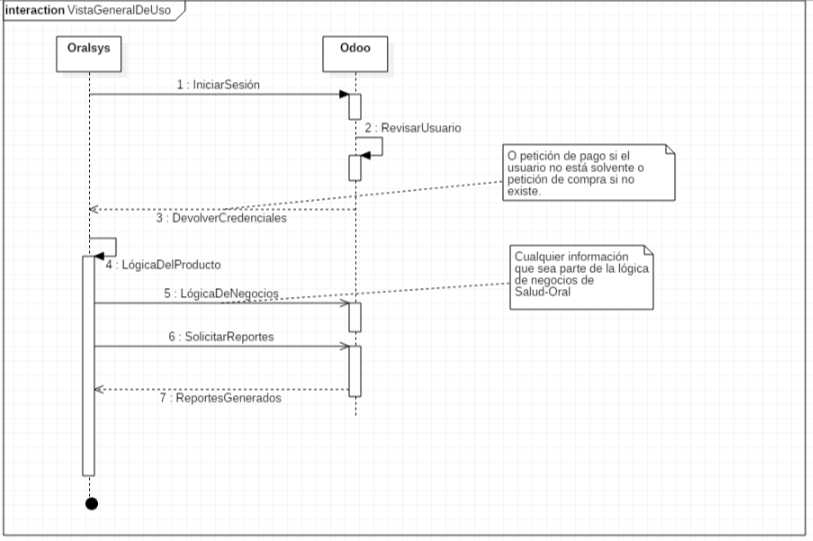
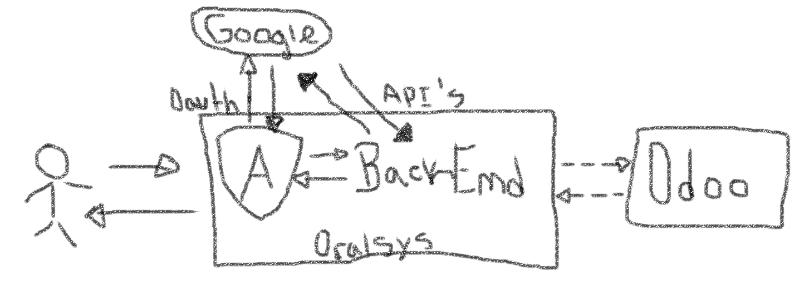

# Documentación y Decisiones sobre la planificación del Proyecto.

Sobre los detalles y decisiones que se han tomado a lo largo de estos días en el proyecto se han establecido directrices que en gran medida se deben seguir para lograr la ejecución del proyecto, al principio se hablaba de una infraestructura compartida entre Angular y Laravel, pero a medida de que se fueron evaluando las condiciones y las mejores alternativas a seguir se llegaron a ciertas conclusiones de lo que debería ser el futuro de este desarrollo; ayudando así a ver un panorama "macro" de la situación y evaluando mejores formas de infraestructura y organización en los distintos productos de la empresa. Entonces, en esta nueva visión del desarrollo tenemos el producto Oralsys que sigue en su funcionalidad específica para la que fue pensado y del otro lado tenemos una instalación de Odoo que funcionaría como el gestor de estos productos, en áreas como la compra de licencias, gestión de compras y ventas, contabilidad analítica de los productos, facturación y el resto de la lógica de la empresa en su conjunto. Una vista general de cómo sería la integración entre los dos sistemas podría darse como en el siguiente diagrama de secuencias:

Entonces, tendríamos un ecosistema de productos que se ejecutan por separado, pero a la vez que garantice una integración correcta entre los distintos componentes. Para los que no sepan que es Odoo su definición se podría dar como esta:

> Odoo es un lote de aplicaciones de código abierto dirigido a empresas que cubre todas las necesidades de su negocio: ERP, CRM, comercio electrónico, contabilidad, inventario, punto de venta, gestión de proyectos etc.
>
> Así, las principales ventajas de este sistema son:
>
> - Permiten agilizar los procesos empresariales gracias a la capacidad de obtener información y procesarla de forma inmediata que proporciona.
> - Crean una visión unificada de la empresa, común a todos los departamentos y trabajadores.
> - Permiten disminuir los tiempos y los costes de los procesos.
> - Proporcionan información fiable e íntegra.
> - Facilitan el proceso de compartir información entre todos los trabajadores de la empresa.
> - Eliminan la posible duplicidad de datos y operaciones innecesarias.
> - Posibilitan el intercambio de datos con otros programas informáticos utilizados en la empresa.

Pensando en esta infraestructura de desarrollo se plantean los grupos y sus responsabilidades de esta manera (a excepción de Oralcare que ya está implementado):

1. Odoo:

   Se encargaría del desarrollo inicial de 3 módulos críticos para el correcto funcionamiento de la infraestructura y los subsecuentes que sean necesarios para las funcionalidades planteadas, para nuestro consumo interno se utilizarían las vistas propias de este sistema añadiendo las características necesarias, los módulos generales a desarrollar son:

   1. Gestor de Licencias: Se encargará de administrar las licencias compradas, en uso, abandonadas, etc. Será el módulo principal que se encargue de la validación de los credenciales de nuestros clientes y usuarios.
   2. Gestión de ventas: Será el módulo de apoyo para él área de licencias y credenciales, además de gestionar la venta de productos del Marketplace desde la plataforma.
   3. Facturación y Reportes: Se debe ajustar los módulos de facturación para la correcta implementación según las normativas del país que no estén en el código base de Odoo, un ejemplo de esto es la inclusión de la facturación con validación electrónica.

2. Oralsys: 

   Estaría encargado de la lógica propia del producto a desarrollar y ofrecer a los clientes, como se tenía planteado desde un inicio, este es independiente y funciona aislado del servidor en Odoo, es decir, bajo ninguna cirscuntancia debe ser absolutamente dependiente del otro. Hay cosas por aclarar aún en este producto en lo que respecta a su desarrollo, aunque lo que ya está decidido es la utilización de Angular como Front End, con respecto al Back End se tienen varias opciones a considerar en la que se debe escoger una opción, la que sea más conveniente.

   Un esquema del funcionamiento de forma general sería:

   

   Bajo este esquema hay que tomar en cuenta, que bajo ninguna circunstancia el navegador debe redireccionar fuera de Angular, primero porque esto rompería el esquema visual de la aplicación y segundo porque el BackEnd bajo la dinámica de su funcionamiento sólo debe ser accedido, si o si, desde el Front, a través de llamadas REST, el Back nunca debe tener endpoints que puedan ser usados con fines diferentes a una llamada desde el Front, puede hacer llamadas a sistemas externos, más no recibirlas; esto por el sencillo motivo de que se rompe el esquema y el porqué se utiliza un FrontEnd como interfaz. Siguiendo esta directriz, la autenticación Oauth con Google se hace vía Angular, ya que es posible y se evita redireccionar fuera del sistema como lo hacen las integraciones comunes desde el Back y sólo se relega a este la verificación del token y el manejo de las API's, los pasos se pueden describir detalladamente de esta manera siguiendo el mismo esquema de la imagen anterior:

   1. Se autentica con Angular.
   2. Google devuelve la información y el token.
   3. Se envía la información necesaria al BackEnd.
   4. El BackEnd verifica el token.
   5. Luego se envían las credenciales a Odoo.
   6. Odoo verifica los datos.
   7. Devuelve las credenciales y su estado.
   8. El BackEnd da paso al sistema si las credenciales son válidas, sino pide al usario registrarse y seguir los pasos para la adquisición de una licencia.

   Al tener esta estructura se simplificaría la integración entre los distintos sistemas y se podría manejar de mejor manera el comportamiento de estos.

Teniendo claro la estructura anterior, se necesita definir el BackEnd a desarrollar, se ha establecido la necesidad de utilización de un Framework (obligatorio) para agilizar las tareas y la integración entre las diferentes personas que conforman este equipo, además de que esto nos libra de tener que establecer normas y reglas estrictas en la escritura y organización del código, así como también nos ayuda a apegarnos a un patrón de desarrollo funcional y estable.

Se consideran por los momentos los siguientes Frameworks por su trayectoria y los aportes que podrían tener dentro del proyecto:

1. [Symfony](https://symfony.com/): Escrito en PHP es un framework enfocado en el desarrollo de aplicaciones web profesionales.
2. [Laravel](https://laravel.com/): También en PHP, se enfoca en agilizar los procesos de desarrollo sin encadenar el software a un patrón o modelo de diseño estricto.
3. [Nest.js](https://nestjs.com/): Escrito en TypeScript y JavaScript ES6, está enfocado en el desarrollo de aplicaciónes profesionales web que estén sustentadas en FrontEnd's como Angular.
4. [Flask](http://flask.pocoo.org): Framework minimalista escrito en Python que permite crear aplicaciones web rápidamente y con un mínimo número de líneas de código.
5. [Django](https://www.djangoproject.com/): También escrito en Python, se describe como el Framework orientado a perfeccionistas, permite desarrollar aplicaciones web de forma rápida y limpia.

Con respecto a este último tema se espera que ustedes como parte del equipo puedan dan sus opiniones y una retroalimentación que puedan ayudar a escoger un Framework que todos puedan usar y desarrollar para este proyecto, salgan de su zona de confort y evalúen las propuestas de manera asertiva y den sus opiniones por el canal #general de Slack, deben explicar el porqué de su decisión y si desean proponer nuevas ideas sustentar estas.

Se desea que ésta fase de requerimiento y planificación inicial termine ésta semana y se pase a la siguiente fase de desarrollo inicial, por los momentos se están diseñando los diagramas pertinentes en UML para un entendimiento más completo del código a desarrollar, vamos a utilizar Scrum como metodología de desarrollo, complementado con Kanban para el analisís de las tareas por desarrollar, de esta forma también les queda como tarea informarse sobre estas metodologías ágiles, cualquier duda a los canales de Slack. Como encargado del desarrollo en Odoo y la integración con Oralsys propongo que luego de decidir, se comienze con la maquetación de todo el Front y el módulo de las licencias en Odoo, de esta manera se pueden evaluar desde un mejor punto de vista, las acciones requeridas dentro del Back.

Sin más, estas son las decisiones tomadas hasta ahora, se esperan sus opiniones y consideraciones con respecto a lo aquí expuesto, feliz semana.

Adolfo Bastardo.